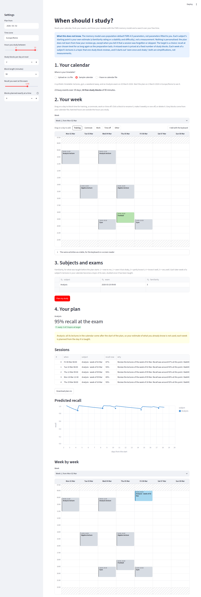

# Constrained-Path Scheduler

A study planner that reads your calendar, finds your exams, and works out when to
study each subject, using a model of forgetting and a search over the time you
actually have free.

Two kinds of tool exist and neither does this. Spaced-repetition software such as
Anki knows how memory decays and assumes you are free whenever a review falls due.
Calendars know exactly when you are busy and nothing about memory. A student with
three exams in three weeks, lectures, a job and a weekend away has to join the two
by hand. This project joins them, and checks every claim it makes about doing so
against exhaustive computation, simulation with error bars, or an independent
implementation.



## Sixty seconds

```bash
python -m venv .venv
source .venv/bin/activate            # Windows PowerShell: .venv\Scripts\Activate.ps1
pip install -e ".[app]"
streamlit run app.py                 # choose "Sample calendar", then "Plan my study"
```

Or from a terminal, on the sample timetable in `examples/`:

```bash
cps plan examples/sample-timetable.ics --from 2026-03-02 --tz Europe/Rome \
         --subject "Analysis:2:7" --subject "Algebra:4:5@2026-03-27" --out plan.ics
```

`Analysis:2:7` is a subject whose memory stability you guess at 2 days and whose
difficulty at 7 on FSRS's 1-to-10 scale; its exam date is found in the calendar.
`@2026-03-27` gives Algebra's date directly. Both subjects' lectures are in the
sample calendar, so each week of them becomes a topic of its own, studied from the
day it is taught; the guess describes what was taught before the plan starts, and
here nothing was, which the plan says. `--whole-subjects` plans each subject as one
item instead. The plan prints with the reason for every session, and `plan.ics` is
a standard calendar file with its time zone defined.

With your own calendar: export it (Google Calendar: Settings, Import and export,
Export; Apple Calendar: File, Export; a university timetable usually has an export
or a subscription link), run `cps inspect your.ics --tz Europe/Rome` first and check
the free blocks it lists, then `cps plan`. On the web page you can also drag your
own training, commutes, work and time off onto the week, like in a calendar app.
No calendar file? Draw the whole week there. `examples/sample-semester.ics` is a
synthetic four-month semester to try the page on.

## How it works

- **Memory.** Each subject is an FSRS-4.5 memory state, stability and difficulty
  (`src/cps/memory.py`). The model matches the reference implementation of the same
  version, py-fsrs 2.5.1, to 4e-14 on two pinned trajectories.
- **The calendar.** An `.ics` export is expanded (recurrences, exclusions, time
  zones, daylight saving) into busy time, a study window is added because nobody's
  calendar says "sleep", and the free time is cut into study blocks
  (`calendar_io.py`, `timegrid.py`).
- **What a subject still costs.** For each subject, a backward sweep over the days
  left before its exam gives the expected number of study blocks needed to reach
  its target, given the time since its last review (`clock.py`). Waiting costs
  something as soon as it eats into the time the remaining reviews need.
- **Lectures become topics.** A subject's lectures in the calendar are its material:
  each week of them is a topic that appears when it is taught, with its own target,
  so a semester is studied as it is taught instead of being "finished" in November
  (`service.py`, METHOD.md §7).
- **The search.** A review can fail, so a plan is a policy, not a sequence: AO*
  searches the AND/OR graph of the next few blocks exactly, with an admissible
  heuristic, takes one step, observes the outcome and replans (`plan.py`,
  `rolling.py`).
- **One API.** The CLI and the web page both call `cps.service` and nothing else,
  which returns plain data, typed errors, a recall curve per subject, and a new plan
  when you report that a session was forgotten or skipped.

`docs/ARCHITECTURE.md` has the data flow as a diagram; `docs/METHOD.md` has the
mathematics and the admissibility arguments.

## Results

All numbers come from `python demo.py` and `python benchmarks/replanning.py`, with
fixed seeds and standard errors.

**On a 21-day calendar with two subjects** (100 seeds, window 4; "ready" means
both subjects reached their stability target before the exam):

| scheduler | ready | blocks | first review | recall at exam | stability at exam |
|---|---|---|---|---|---|
| this planner | 90% ± 3% | 4.95 | day 2.3 | 0.932 | 20.5 days |
| review when recall falls to 0.90 (Anki's default) | 0% | 3.74 | day 2.3 | 0.920 | 17.0 days |
| review every day (best of every 1 to 7 days) | 93% ± 3% | 15.81 | day 1.3 | 0.943 | 21.4 days |

Read it with the limits below: the planner's advantage is memory that lasts past
the exam, which is what it is asked to produce, not exam-day recall.

**Unconstrained, one subject** (value iteration against simulation): the optimal
policy needs 6.02 ± 0.09 reviews from a fresh item, against 7.41 ± 0.10 at a fixed
retention of 0.90 and 6.94 ± 0.11 at the best fixed retention chosen in hindsight.
Fixed retention turns out to be a sawtooth, not a curve (METHOD.md §2).

**The search is exact where it can be checked.** On a five-block instance with
3,906 reachable states, AO* reproduces the optimum of exhaustive backward induction
with four different heuristics, each verified admissible at every one of those
states, in 114 node expansions with the best of them.

**A semester** (`python benchmarks/semester.py`: six courses taught from 28
September to 18 December, exams from 25 to 29 January, two 90-minute blocks a day at
most). Planned with each course as one item already partly known, the plan has 27
sessions and the last one on 23 November: nothing in the two months before the
exams. With a topic per week of lectures it has 222 sessions spread over all 18
weeks, 84 of them after teaching ends, and 63 of 69 topics reach their target. The
six that fall short are the earliest material, what was taught before the start and
in the first two weeks, whose targets are the highest (112 to 119 days): they end at
62 to 77 days, because two blocks a day also have to cover
everything taught later. Planning took 38 seconds.

**Two findings a student can use.** Spacing, not the number of free evenings, is
what runs out: five daily blocks cannot build 21 days of stability however they are
spent, because every gap is one day; seven can. And the objective is flat in the
middle of a plan, so fitting study around lectures and sleep costs almost nothing.

## Limits

- **It does not beat Anki's rule on exam-day recall.** Reviewing whenever recall
  falls to 0.90 predicts 0.920 recall at the exam against the planner's 0.932, with
  1.2 fewer blocks. The planner reaches a durable target that rule never reaches,
  because its next review would fall after the exam. If you only care about the
  morning of the exam, you do not need this.
- **It does not know you.** The FSRS parameters are population defaults, and a
  subject's starting point is your own estimate. It adapts only when you report
  that a session was forgotten or skipped.
- **Its targets are choices.** A subject is "ready" when its stability would keep
  recall at 90% for as long again as the preparation lasted; an unready exam is
  priced at 40 study blocks. Both are stated, and both change the plan.
- **Its estimates are estimates.** The value it plans with is 0.1 to 0.7 blocks
  optimistic against simulation; readiness is 90% ± 3%, not a guarantee.
- **A topic is a week of one subject.** One study block reviews a week of lectures,
  fresh lectures start "seen once and shaky", and the lecture itself is not counted
  as a review. These are simplifications, and the app lists them.
- **It is not instant.** A four-month semester of six subjects takes about half a
  minute to plan, a replan less; most of it is the search over each window.
- **Timing is at the level of days.** Blocks are placed at the start of each free
  stretch; FSRS measures stability in days, so the hour barely matters.

## What was wrong before, and how it was found

This repository is a rebuild. The January 2026 version claimed a 32.2% retention
improvement and an optimal schedule; its memory model could not see time, its A*
never returned a solution, and its calendar parser was a stub. `AUDIT.md` lists
those defects and every one found since, 35 in all, including a planner that put
the first review on day 16 of 21 (fixed), two separate mixes of FSRS versions
(fixed), and a corroborating claim that had no source (withdrawn).
`docs/WRITEUP.md` tells that story; `docs/PROCESS.md` is the full record, mistakes
included; `docs/REFERENCES.md` says how every reference was checked.

## Repository

| path | what it is |
|---|---|
| `app.py` | the web page; input and layout only |
| `widgets/` | the drag-and-drop week calendar the page draws with (JavaScript, no build step) |
| `src/cps/service.py` | the one API every front end uses |
| `src/cps/cli.py` | `cps inspect` and `cps plan` |
| `src/cps/memory.py` | FSRS-4.5, checked against py-fsrs 2.5.1 |
| `src/cps/calendar_io.py`, `timegrid.py` | calendars in and out; free time as a bitmask |
| `src/cps/clock.py` | cost to reach a subject's target before its exam |
| `src/cps/ssp.py` | the unconstrained optimum (SSP-MMC) and its admissible bound |
| `src/cps/plan.py`, `rolling.py` | AO* over the calendar, and replanning over a real horizon |
| `src/cps/budget.py` | the superseded block-budget continuation (AUDIT item 20) |
| `src/cps/legacy.py` | the January 2026 model, kept as a failing test |
| `benchmarks/` | the scripts behind every number that is not in `demo.py` |
| `docs/` | method, process, architecture, write-up, references |
| `archive/2025-prototype/` | the December 2025 prototype and reports, unchanged |

## Checking it yourself

```bash
pip install -e ".[dev,app]"
pytest                                    # 252 passed, 12 deselected (slow), 1 xfailed, ~45 s
pytest -m "slow or not slow" --cov=cps    # everything: 264 passed, 1 xfailed, 93% coverage
ruff check . && ruff format --check . && mypy
python demo.py                            # the numbers in the documents
python benchmarks/replanning.py           # the results table above
python benchmarks/semester.py             # a semester, with and without lectures as topics
```

CI runs all of it on Ubuntu and Windows, Python 3.11 to 3.13. The one expected
failure is deliberate: it pins the January model's inability to represent the
spacing effect, and it is strict, so the build breaks if it ever passes.

On Windows, if PowerShell refuses to run `Activate.ps1`, run
`Set-ExecutionPolicy -ExecutionPolicy RemoteSigned -Scope CurrentUser` once; open
the project folder itself in the terminal before creating the environment.

## Licence

MIT, see `LICENSE`.
