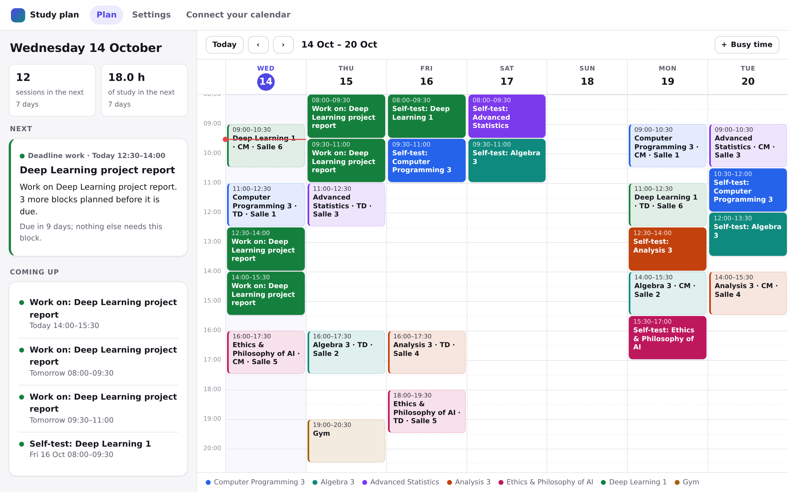
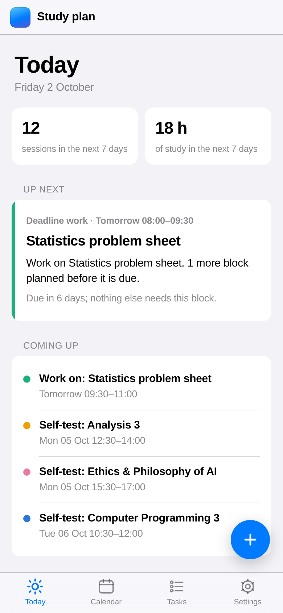
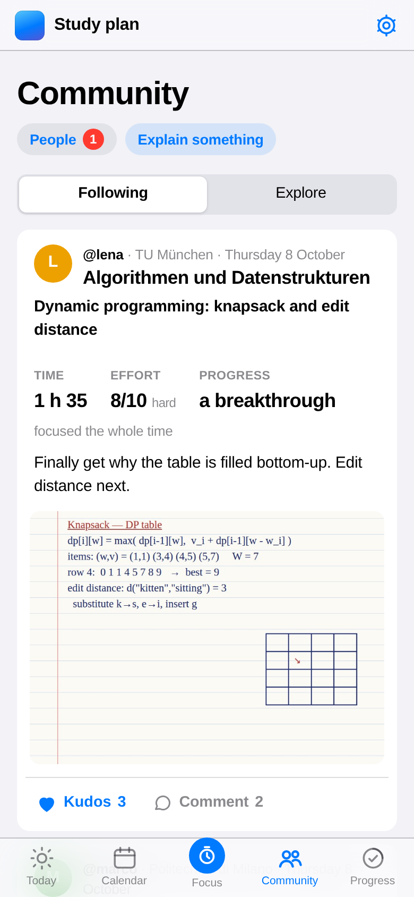
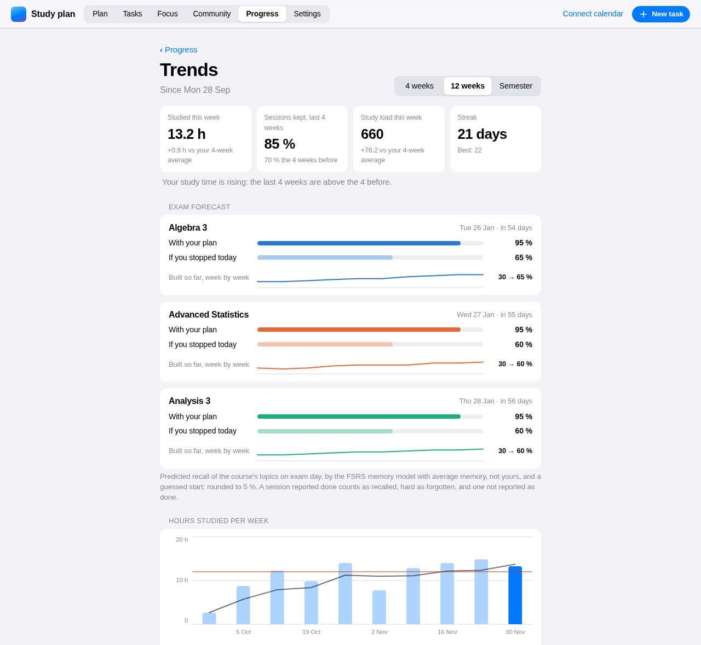
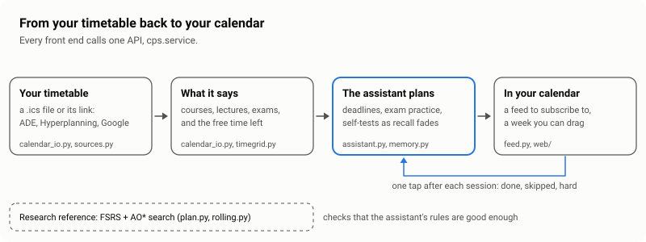
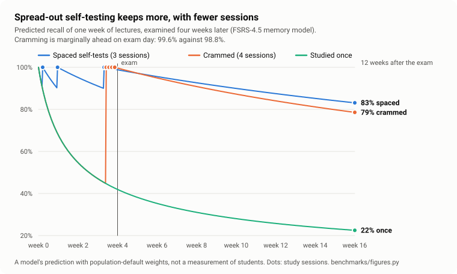
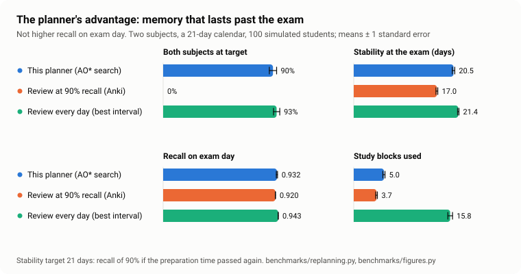
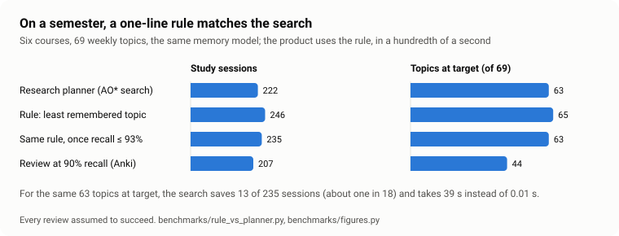

# Constrained-Path Scheduler

A study assistant for busy students. It reads your university timetable (a file or
its link), finds your courses, lectures and exams, takes your deadlines and the hours
you are willing to study, and puts a realistic plan in your calendar: deadlines met,
each exam prepared with practice, the material of each week tested again as it
fades, days off kept free, and a sentence in every session saying what to do.

It began as a research question: can a memory model and an exact search over your
free time plan revision better than a simple rule? The answer, measured on a
semester, is "barely" (AUDIT.md item 36), so the product schedules with rules that
run in a hundredth of a second, and the search stays as the reference that shows
they are good enough. Every claim here is checked against exhaustive computation,
simulation with error bars, an independent implementation, or a benchmark you can
run. Where this is going as a product, and what it still lacks, is in
`docs/PRODUCT.md`.

<p align="center">
  
  &nbsp;
  
</p>
<p align="center"><sub><code>cps web</code> on <code>examples/sample-semester.ics</code> (synthetic), as it looks on 2 October 2026 with two deadlines added (left) and, with sessions reported for two weeks, on Monday 12 October (right).</sub></p>

<p align="center">
  
</p>
<p align="center"><sub>The Community tab (8 October 2026), with five invented students at five universities and a drawn page of notes; none of it is real data.</sub></p>

<p align="center">
  
</p>
<p align="center"><sub>Trends on 3 December 2026 for a synthetic student: <code>examples/sample-semester.ics</code>, sessions reported at random for ten weeks, focus sessions logged; not real data.</sub></p>

<picture>
  <source media="(prefers-color-scheme: dark)" srcset="docs/figures/pipeline-dark.svg">
  
</picture>

## Why spaced self-testing

<picture>
  <source media="(prefers-color-scheme: dark)" srcset="docs/figures/spacing-dark.svg">
  
</picture>

Two of the best-supported techniques in the research on learning are spreading study
out over time and testing yourself instead of rereading; a review of ten techniques
rated these two, and only these, of high utility [ref:dunlosky2013]. The memory model
the planner uses, FSRS-4.5, reproduces both. For one week of lectures examined four
weeks later, three self-tests, each when predicted recall falls to 90%, keep 83%
twelve weeks after the exam; four sessions crammed into the last four days keep 79%,
though they are marginally ahead on exam day (99.6% against 98.8%); studied once and
never again, 22%. This is the model's prediction with population-default weights, not
a measurement of students; `python benchmarks/figures.py` draws it and prints every
number. Every session the assistant plans is built on it: a self-test when material
fades, spread out, and a sentence saying what to do.

## Sixty seconds

```bash
python -m venv .venv
source .venv/bin/activate            # Windows PowerShell: .venv\Scripts\Activate.ps1
pip install -e ".[app]"
streamlit run app.py                 # choose "Sample calendar", then "Plan my study"
```

The page plans with the assistant: add deadlines under "Deadlines", and set the hours
a week and the days off in the sidebar. The sidebar also switches to the research
planner. The command line runs the research planner, on the sample timetable in
`examples/`:

```bash
cps plan examples/sample-timetable.ics --from 2026-03-02 --tz Europe/Rome \
         --subject "Analysis:2:7" --subject "Algebra:4:5@2026-03-27" --out plan.ics
```

`Analysis:2:7` is a subject whose memory stability you guess at 2 days and whose
difficulty at 7 on FSRS's 1-to-10 scale; its exam date is found in the calendar.
`@2026-03-27` gives Algebra's date directly. Both subjects' lectures are in the
sample calendar, so each week of them becomes a topic of its own, studied from the
day it is taught; the guess describes what was taught before the plan starts, and
here nothing was, which the plan says. `--whole-subjects` plans each subject as one
item instead. The plan prints with the reason for every session, and `plan.ics` is
a standard calendar file with its time zone defined.

With your own calendar: export it (Google Calendar: Settings, Import and export,
Export; Apple Calendar: File, Export), or give its link: a university timetable
(ADE, Hyperplanning) has an export or subscription address, and Google Calendar a
"secret address in iCal format". Run `cps inspect your.ics --tz Europe/Rome` (or
`cps inspect "https://…"`) first and check the free blocks it lists, then `cps plan`. On the web page you can also drag your
own training, commutes, work and time off onto the week, like in a calendar app.
No calendar file? Draw the whole week there. `examples/sample-semester.ics` is a
synthetic four-month semester to try the page on.

## How it works

- **Memory.** Each subject is an FSRS-4.5 memory state, stability and difficulty
  (`src/cps/memory.py`). The model matches the reference implementation of the same
  version, py-fsrs 2.5.1, to 4e-14 on two pinned trajectories.
- **The calendar.** An `.ics` export is expanded (recurrences, exclusions, time
  zones, daylight saving) into busy time, a study window is added because nobody's
  calendar says "sleep", and the free time is cut into study blocks
  (`calendar_io.py`, `timegrid.py`).
- **What a subject still costs.** For each subject, a backward sweep over the days
  left before its exam gives the expected number of study blocks needed to reach
  its target, given the time since its last review (`clock.py`). Waiting costs
  something as soon as it eats into the time the remaining reviews need.
- **Lectures become topics.** A subject's lectures in the calendar are its material:
  each week of them is a topic that appears when it is taught, with its own target,
  so a semester is studied as it is taught instead of being "finished" in November
  (`service.py`, METHOD.md §7).
- **The assistant.** Each free block goes to the first rule that wants it: a
  deadline that is getting close (earliest deadline first), exam practice in the last
  two weeks, self-testing on the taught topic you remember least, working ahead, or
  nothing, within your weekly hours and never on a day off (`assistant.py`,
  METHOD.md §8).
- **The search (research planner).** A review can fail, so a plan is a policy, not a sequence: AO*
  searches the AND/OR graph of the next few blocks exactly, with an admissible
  heuristic, takes one step, observes the outcome and replans (`plan.py`,
  `rolling.py`).
- **One API.** The CLI and the web page both call `cps.service` and nothing else,
  which returns plain data, typed errors, a recall curve per subject, and a new plan
  when you report that a session was forgotten or skipped.

`docs/ARCHITECTURE.md` has the data flow as a diagram; `docs/METHOD.md` has the
mathematics and the admissibility arguments.

## The hosted app

`cps web` is the product as students would use it: one server for the pages, the
calendar feeds and the reports, built for a phone and for a pilot on a small host
(`docs/DEPLOY.md`, `render.yaml`), in French and English (the language is the plan's;
what is still English is AUDIT.md item 40).

```bash
pip install -e ".[web]"
cps web                        # http://127.0.0.1:8000
```

1. **Start**: paste the timetable's link (or choose its file). The exams in it are
   found; the week starts at 15 hours with Sundays off, both stated defaults.
2. **Settings**: check the exams, add deadlines (or the learning platform's calendar
   link, and Moodle's assignments and quizzes arrive by themselves at a guessed 2
   hours each), weekly hours, days off.
3. **Your plan**: one screen, the calendar beside what is next, what to report,
   tasks with their progress and exams with their countdown. Each course has a
   colour: its lectures a faint tint, its study sessions a stronger one; a red line
   marks the time. Drag on empty time (tap, on a phone) to block training, work, a
   commute or time off. Drag a study session to move it: it stays where you put it,
   and the rest of the plan makes room at once; a move onto a lecture, into the past
   or past a deadline is refused with the reason. Click any session for what to do,
   why, "done, skipped, hard", and moving it by date and time. Day, three days or a
   week (← → to move, T for today); tabs at the bottom on a phone.
4. **Tasks**, as in Motion: a new-task sheet on every page (the + button, or N) with
   one-tap due dates and durations, and a line to type it in words ("stats report for
   Friday, about 6 h", or in French) that fills the fields in to check; by rules, or
   by a model if the server has a key and the student turns AI on (D12, capped); the Tasks page lists each with its sessions done
   and the next one; tick it off when it is finished and its remaining sessions become
   free time (with an Undo).
5. **Progress**, a reason to come back (`docs/STRATEGY.md`): the week's sessions done
   in a ring, a streak of days studied, the weeks since the plan began day by day,
   milestones, each exam's readiness, and on Mondays last week in a paragraph with
   one suggestion (sessions skipped at the same time of day, a week much heavier than
   what was done, an exam close). The streak forgives: days off are neutral, one day a
   week without a report is forgiven, a late report counts on its day, and a lost
   streak is never announced (DECISIONS.md, D9). **Trends** show the trajectory:
   hours per week against your own 4-week average and weekly limit, sessions kept,
   study load (minutes × effort), courses, the time of day you keep sessions, and an
   exam forecast from the memory model (predicted recall on exam day with the plan,
   and if you stopped today); each self-test says what it adds on exam day. Light,
   dark or automatic, in Settings.
6. **Focus and Community**, a study network in Strava's shape (DECISIONS.md, D16 to
   D19): start a timer for a course or the plan's session; the page counts the time
   you spend away from it and says so on the session (a web page cannot block other
   apps). Then say how it went: what you did, effort out of 10, progress, notes,
   photos of your own work, and who sees it. Every session goes to your diary and
   counts for the streak. With a handle, a university and a programme you can share:
   a Following feed, an Explore feed across universities and programmes, kudos,
   comments, and "Explain it simply" posts that readers of other subjects mark
   "I got it". Follows are asked for and accepted; nobody's follower count is shown.
   **Notes**: share your own notes of a course as photos of the pages; others mark
   them helpful, and each month the three most helpful notes of each course are
   marked for everyone to find. Notes are ranked, never people, and nothing is paid
   (D26).
7. **Two addresses**: the Today page, and a calendar feed to subscribe to in Google
   Calendar, Apple Calendar or Outlook. The feed follows the timetable's link.
8. **After each session**: its calendar event links to a page that asks how it went.
   Done, skipped or hard, in one tap; the plan changes at once. A self-test asks
   how much you could recall without your notes (nothing, some, most, all), and the
   memory model takes the answer as it is: what you could not recall comes back
   sooner. Hard deadline work gets one more session.

No account and no password: the two addresses are the keys, as with any calendar
subscription link, and the page says so. No cookies, no trackers, nothing loaded
from another site; the scripts are the site's own, and every page works without them; the
log names routes, never the secret addresses; a link in an event never changes
anything by being opened, only the button on its page does. Plans are deleted 30
days after their last exam or deadline, or at once from Settings. `src/cps/web/app.py`
lists the rest of the security model.

What it does not do yet, said plainly:

- **It runs nowhere yet.** Hosting it is the owner's step (C1 in
  `docs/ROADMAP.md`); until then, only a calendar app on the same machine can read
  a feed, since Google Calendar reads feeds from Google's servers.
- **Sessions you do not report count as done.** The plan cannot tell a skipped
  session from a forgotten report.
- **Google Calendar reads a subscribed feed on its own schedule**, often hours
  apart, so a change reaches the calendar late; the Today page is always current.
  Writing into Google Calendar directly needs Google's verification (Phase 2).
- **Moodle only, in English.** Other platforms, and Moodle in other languages, name
  their events differently.

The Streamlit page (`app.py`) is the workbench: the research planner, the recall
curves, the drag-and-drop week ([screenshot](docs/app-screenshot.png)). It can still publish a feed for `cps serve` to
answer on the same machine; reports do not reach those feeds.

## Results

All numbers come from `python demo.py` and `python benchmarks/replanning.py`, with
fixed seeds and standard errors; the figures from `python benchmarks/figures.py`, which
reruns the benchmarks and prints what it draws.

**On a 21-day calendar with two subjects** (100 seeds, window 4; "ready" means
both subjects reached their stability target before the exam):

<picture>
  <source media="(prefers-color-scheme: dark)" srcset="docs/figures/planner-vs-schedulers-dark.svg">
  
</picture>

| scheduler | ready | blocks | first review | recall at exam | stability at exam |
|---|---|---|---|---|---|
| this planner | 90% ± 3% | 4.95 | day 2.3 | 0.932 | 20.5 days |
| review when recall falls to 0.90 (Anki's default) | 0% | 3.74 | day 2.3 | 0.920 | 17.0 days |
| review every day (best of every 1 to 7 days) | 93% ± 3% | 15.81 | day 1.3 | 0.943 | 21.4 days |

Read it with the limits below: the planner's advantage is memory that lasts past
the exam, which is what it is asked to produce, not exam-day recall.

**Unconstrained, one subject** (value iteration against simulation): the optimal
policy needs 6.02 ± 0.09 reviews from a fresh item, against 7.41 ± 0.10 at a fixed
retention of 0.90 and 6.94 ± 0.11 at the best fixed retention chosen in hindsight.
Fixed retention turns out to be a sawtooth, not a curve (METHOD.md §2).

**The search is exact where it can be checked.** On a five-block instance with
3,906 reachable states, AO* reproduces the optimum of exhaustive backward induction
with four different heuristics, each verified admissible at every one of those
states, in 114 node expansions with the best of them.

**A semester** (`python benchmarks/semester.py`: six courses taught from 28
September to 18 December, exams from 25 to 29 January, two 90-minute blocks a day at
most). Planned with each course as one item already partly known, the plan has 27
sessions and the last one on 23 November: nothing in the two months before the
exams. With a topic per week of lectures it has 222 sessions spread over all 18
weeks, 84 of them after teaching ends, and 63 of 69 topics reach their target. The
six that fall short are the earliest material, what was taught before the start and
in the first two weeks, whose targets are the highest (112 to 119 days): they end at
62 to 77 days, because two blocks a day also have to cover
everything taught later. Planning took 38 seconds.

**Does the search earn its keep?** (`python benchmarks/rule_vs_planner.py`, the same
semester, topics and memory model, every review assumed to succeed)

<picture>
  <source media="(prefers-color-scheme: dark)" srcset="docs/figures/search-vs-rules-dark.svg">
  
</picture>

| scheduler | sessions | topics at target | recall at the exams | time |
|---|---|---|---|---|
| research planner (value functions and AO*) | 222 | 63 of 69 | 0.967 | about 40 s |
| rule: study the taught topic you remember least | 246 | 65 of 69 | 0.980 | 0.01 s |
| the same rule, only once recall is 0.93 or less | 235 | 63 of 69 | 0.978 | 0.01 s |
| rule: review at recall 0.90, as Anki does | 207 | 44 of 69 | 0.957 | 0.01 s |

The search saves about one session in twenty on its own objective. The assistant
uses the rule and adds what the planner never modelled; with 15 hours a week, Sundays
off and exam practice, it plans the same semester in 174 sessions, and 51 of the 69
topics are predicted at 90% or more at their exam, which it says, instead of quietly
asking for more hours.

**Two findings a student can use.** Spacing, not the number of free evenings, is
what runs out: five daily blocks cannot build 21 days of stability however they are
spent, because every gap is one day; seven can. And the objective is flat in the
middle of a plan, so fitting study around lectures and sleep costs almost nothing.

## Limits

- **It does not beat Anki's rule on exam-day recall.** Reviewing whenever recall
  falls to 0.90 predicts 0.920 recall at the exam against the planner's 0.932, with
  1.2 fewer blocks. The planner reaches a durable target that rule never reaches,
  because its next review would fall after the exam. If you only care about the
  morning of the exam, you do not need this.
- **It does not know you.** The FSRS parameters are population defaults, and a
  subject's starting point is your own estimate. It adapts only when you report
  that a session was forgotten or skipped.
- **Its targets are choices.** A subject is "ready" when its stability would keep
  recall at 90% for as long again as the preparation lasted; an unready exam is
  priced at 40 study blocks. Both are stated, and both change the plan.
- **Its estimates are estimates.** The value it plans with is 0.1 to 0.7 blocks
  optimistic against simulation; readiness is 90% ± 3%, not a guarantee.
- **The assistant trusts your estimates.** How long a task takes is yours to say,
  and a session counts as done until you report otherwise. The streak does not:
  it counts only the sessions you report done or hard.
- **A topic is a week of one subject.** One study block reviews a week of lectures,
  fresh lectures start "seen once and shaky", and the lecture itself is not counted
  as a review. These are simplifications, and the app lists them.
- **It is not instant.** A four-month semester of six subjects takes about half a
  minute to plan, a replan less; most of it is the search over each window.
- **Timing is at the level of days.** Blocks are placed at the start of each free
  stretch; FSRS measures stability in days, so the hour barely matters.

## What was wrong before, and how it was found

This repository is a rebuild. The January 2026 version claimed a 32.2% retention
improvement and an optimal schedule; its memory model could not see time, its A*
never returned a solution, and its calendar parser was a stub. `AUDIT.md` lists
those defects and every one found since, 47 in all, including a planner that put
the first review on day 16 of 21 (fixed), two separate mixes of FSRS versions
(fixed), and a corroborating claim that had no source (withdrawn).
`docs/WRITEUP.md` tells that story; `docs/PROCESS.md` is the full record, mistakes
included; `docs/REFERENCES.md` says how every reference was checked.

## How it was built

The December 2025 prototype, kept unchanged in `archive/2025-prototype/`, is where
this started. The rebuild was written with an AI coding assistant (Claude Code) as
a pair programmer, and the commit history shows which commits it wrote. It works
to the rules in `CLAUDE.md`: every number in a document is reproduced by code, every
defect found goes into `AUDIT.md` before or with its fix, and no test is loosened to
get a green build. The questions, the decisions on scope and method, and the checks
in a real browser are the owner's.

## Repository

| path | what it is |
|---|---|
| `app.py` | the web page; input and layout only |
| `widgets/` | the Streamlit workbench's drag-and-drop week (JavaScript, no build step) |
| `src/cps/service.py` | the one API every front end uses |
| `src/cps/assistant.py` | the assistant's rules: deadlines, budget, days off, exam practice, self-testing |
| `src/cps/progress.py` | the streak, the week's ring and the day grid, derived from the plan and the reports |
| `src/cps/i18n.py`, `locales/` | French and English: one catalogue keyed by the English sentence |
| `src/cps/web/` | the hosted app (`cps web`): the plan screen and its calendar (`static/calendar.js`), setup, feeds, one-tap reports |
| `src/cps/store.py` | the SQLite store: one document per plan, versioned updates, expiry, backups |
| `src/cps/cli.py` | `cps inspect`, `plan`, `serve`, `web`, `sweep` and `backup` |
| `src/cps/sources.py` | calendars from a link, with the refusals a server needs |
| `src/cps/feed.py` | the feed server calendar apps subscribe to, and background refresh |
| `src/cps/memory.py` | FSRS-4.5, checked against py-fsrs 2.5.1 |
| `src/cps/calendar_io.py`, `timegrid.py` | calendars in and out; free time as a bitmask |
| `src/cps/clock.py` | cost to reach a subject's target before its exam |
| `src/cps/ssp.py` | the unconstrained optimum (SSP-MMC) and its admissible bound |
| `src/cps/plan.py`, `rolling.py` | AO* over the calendar, and replanning over a real horizon |
| `src/cps/budget.py` | the superseded block-budget continuation (AUDIT item 20) |
| `src/cps/legacy.py` | the January 2026 model, kept as a failing test |
| `benchmarks/` | the scripts behind every number that is not in `demo.py` |
| `docs/` | method, process, architecture, write-up, references, product, market, strategy, design |
| `DECISIONS.md` | architecture and product decisions after the roadmap's D1 to D7 |
| `archive/2025-prototype/` | the December 2025 prototype and reports, unchanged |

## Checking it yourself

```bash
pip install -e ".[dev,app,web,ai]"
pytest                                    # 525 passed, 14 deselected (slow), 1 xfailed, ~100 s
pytest -m "slow or not slow" --cov=cps    # everything: 539 passed, 1 xfailed, 93% coverage
ruff check . && ruff format --check . && mypy
python demo.py                            # the numbers in the documents
python benchmarks/replanning.py           # the results table above
python benchmarks/semester.py             # a semester, with and without lectures as topics
python benchmarks/rule_vs_planner.py      # the research planner against one-line rules
python benchmarks/figures.py              # the README's figures, from the runs above
python benchmarks/reviews.py              # competitors' App Store reviews, coded by theme
```

CI runs all of it on Ubuntu and Windows, Python 3.11 to 3.13. The one expected
failure is deliberate: it pins the January model's inability to represent the
spacing effect, and it is strict, so the build breaks if it ever passes.

On Windows, if PowerShell refuses to run `Activate.ps1`, run
`Set-ExecutionPolicy -ExecutionPolicy RemoteSigned -Scope CurrentUser` once; open
the project folder itself in the terminal before creating the environment.

## Licence

MIT, see `LICENSE`.
