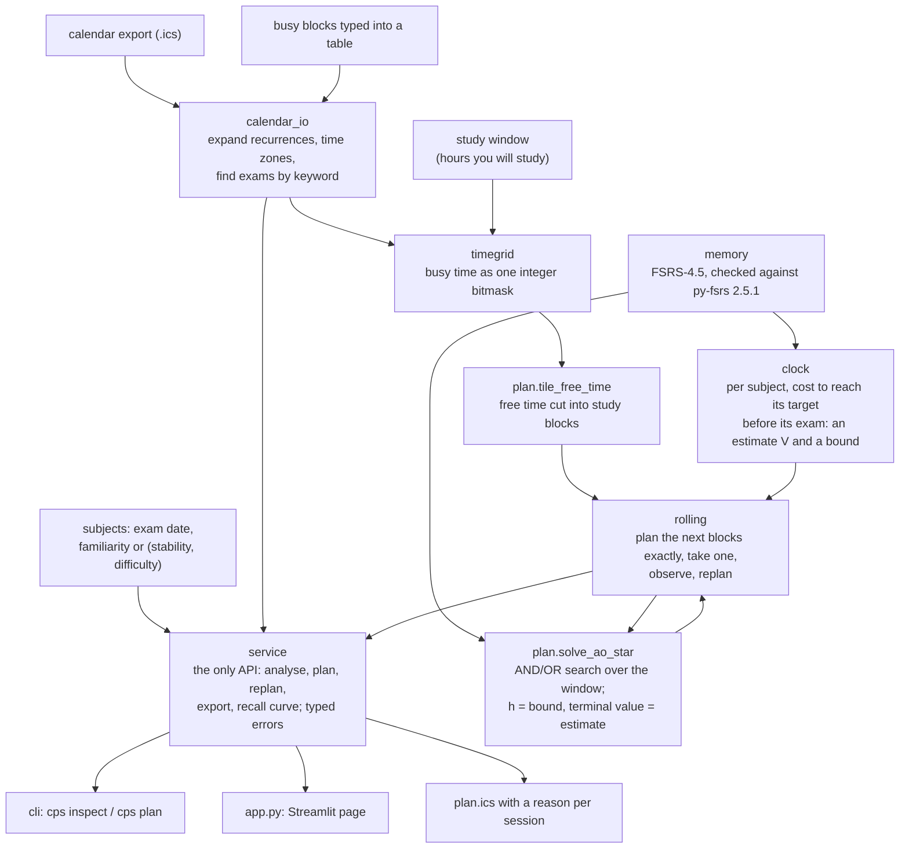

# Architecture

How a calendar becomes a plan, which module does each step, and where the
guarantees sit. The mathematics is in `METHOD.md`; this page is the map.

## The layers

**Input.** `calendar_io` turns an `.ics` (or `busy_from_table`, rows typed by
hand) into concrete busy intervals on the local wall clock, and finds assessments
by keyword ("exam", "esame", "partiel", ...). `timegrid` stores busy time as one
Python integer, one bit per half hour, so a free-time check is a mask and a compare
and a grid is immutable and hashable. `plan.tile_free_time` cuts the free time
into study blocks, earliest first, capped per day.

**Model.** `memory` is FSRS-4.5 with its 17 named parameters. Everything that
predicts recall goes through it; `ssp` has a vectorised twin that a test keeps in
step.

**Value.** `clock` solves, for each subject, the expected cost in study blocks of
reaching that subject's target before its own exam, as a function of difficulty,
stability, days left and days since the last review. It is solved twice: an
accurate estimate, and an optimistic lower bound that a search may use as a
heuristic. `ssp` is the unconstrained version, used for analysis and by the one-shot
solver; `budget` is the superseded block-count version (AUDIT.md item 20).

**Search.** `plan` defines the problem (states, actions, successors, the goal) and
solves it with AO*, which returns a policy because a review can fail. `rolling`
makes it tractable on a real horizon: it plans a window of a few blocks exactly,
ending on the accurate estimate and guided by the bound, executes one block, and
replans with what happened.

**Surface.** `service` is the only thing a front end may call. It validates input,
returns frozen results with `to_dict()` in plain JSON types, turns a user's mistake
into a typed error with a sentence saying what to do, replans after a session is
reported forgotten or skipped, and shapes tables for display. `cli` prints what it
returns; `app.py` lays it out. A test fails if `app.py` imports anything from `cps`
except `service`.

## Where the guarantees are checked

| claim | where it is checked |
|---|---|
| the memory model is FSRS-4.5 | `tests/test_memory.py`, exact against py-fsrs 2.5.1 |
| the heuristic is admissible | `tests/test_plan.py` and `tests/test_rolling.py`, against exhaustive search at every reachable state |
| the bound is below the estimate | `tests/test_clock.py` and `tests/test_ssp.py`, cell by cell |
| estimates are calibrated | Monte Carlo with standard errors in `tests/test_clock.py`, `tests/test_ssp.py` |
| aggregation does not change the cost | `plan.evaluate_exact_dynamics`, `tests/test_plan.py` |
| the page computes nothing itself | `tests/test_app.py`, by syntax tree and by comparing tables |
| every number in the documents | `demo.py` and `benchmarks/`, fixed seeds |
| every reference | `tests/test_references.py` against `docs/REFERENCES.md` |
